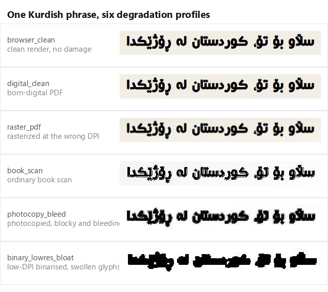
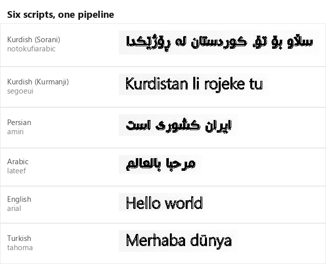
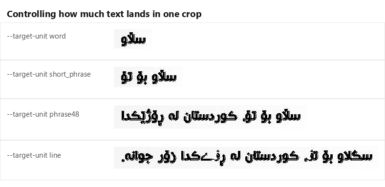

# Synthetic OCR Dataset Generator

Generate synthetic text-line images for training OCR recognition models, with labels you already know are correct.

The script takes real text, renders it with a real browser using real font files, damages the result in
realistic ways (scanner noise, photocopy bleed, JPEG compression, skew, paper stains), and writes out
training data in the format [PaddleOCR](https://github.com/PaddlePaddle/PaddleOCR) expects.

It was built for Kurdish, Arabic-script and Persian documents, but nothing in the script is specific to
one language. Any script a browser can shape can be rendered.

---

## Why render with a browser?

Most synthetic OCR data is drawn with a text rasterizer such as Pillow's `ImageDraw`. That works, but it
quietly produces images that do not look like real documents:

- Arabic-script letters are **not joined**, because the rasterizer does not do shaping.
- **Ligatures, kerning and mark positioning** are missing.
- The **bidi algorithm** is not applied, so mixed-direction text comes out in the wrong order.

A browser already solves all of this. So this script builds an HTML page, lets Chrome or Edge lay it out
correctly, and takes a screenshot. What you get is what a real document looks like.

Below, the same Kurdish phrase drawn six times, with only the damage applied differently. Nothing about the
text or the font changes between rows:



Look closely at the rows above: letters are **joined** along the baseline, the dots above and below sit
where a reader expects them, and the `ڵ`, `ڕ`, `ۆ`, `ێ` and `ە` of the Kurdish alphabet are all distinct.
Those are exactly the details a rasterizer gets wrong and a browser gets right.

Six writing systems through the identical pipeline:



And the control that decides how much text a model has to read in one go:



All images above were generated by this script and are committed unmodified.

---

## Requirements

| Requirement | Notes |
|---|---|
| Python 3.10 or newer | Uses modern type hints. |
| Google Chrome or Microsoft Edge | Any recent version. Used for rendering. |
| `opencv-python` | Degradation pipeline. |
| `numpy` | Degradation pipeline. |
| `Pillow` | Image handling and the optional fallback renderer. |
| `mwparserfromhell` | *Optional.* Better Wikipedia wikitext cleaning. |
| `asosoft` | *Optional.* Stronger Kurdish/Arabic text normalization. Not on PyPI. |

Install the required Python packages:

```bash
pip install opencv-python numpy Pillow mwparserfromhell
```

Chrome and Edge are found automatically on Windows, macOS and Linux. If yours is installed somewhere
unusual, point at it with `--browser-exe /path/to/chrome`.

---

## Quick start

### Render a list of labels you already have

The fastest way to see it work. Give it a plain text file, one label per line:

```bash
python generate_ocr_dataset.py \
  --output-dir ./out \
  --fonts-dir ./fonts \
  --label-source-manifest labels.txt \
  --max-lines 500 \
  --target-unit short_phrase
```

### Build a dataset from a Wikipedia dump

```bash
python generate_ocr_dataset.py \
  --output-dir ./out \
  --fonts-dir ./fonts \
  --source ./sources/fawiki.xml.bz2:wikipedia \
  --target-unit phrase48 \
  --degradation-profile mixed \
  --max-lines 20000 \
  --val-count 500 \
  --sheet-workers 4
```

### Check your setup without generating anything

```bash
python generate_ocr_dataset.py \
  --output-dir ./out --fonts-dir ./fonts \
  --source ./sources/fawiki.xml.bz2:wikipedia \
  --dry-run
```

This prints every effective setting, the fonts it found, and which sources are readable. It writes nothing.

---

## How it works

```
text source (Wikipedia dump / JSONL / label file)
        |
        v
  clean + normalize text        strip wikitext, unify Arabic letter variants,
        |                       handle ZWNJ, tatweel, diacritics
        v
  cut into text units           word / short phrase / 48-char phrase / full line
        |
        v
  build one HTML "sheet"         many independent lines on one tall page
        |
        v
  screenshot with Chrome         one browser launch captures up to --sheet-lines lines
        |
        v
  crop each line out
        |
        v
  damage it                      scanner/photocopy degradation pipeline
        |
        v
  write JPEG + manifest rows     train_list.txt, val_list.txt, metadata.jsonl
```

**Batching is the key to speed.** Launching a browser per line would be unusably slow. Instead, up to
`--sheet-lines` lines are placed on one page and captured in a single screenshot, then cropped apart. In
testing this reaches roughly 25-35 line images per second on a laptop.

---

## What you get

```
out/
  images/
    line_0000000000.jpg
    line_0000000001.jpg
    ...
  train_list.txt
  val_list.txt
  metadata.jsonl
  generator_config.json
```

`train_list.txt` and `val_list.txt` use the PaddleOCR training format: an image path, a tab, then the
label. Point `--character-dict-path` style configs at them and train.

`metadata.jsonl` has one JSON object per generated image, with everything needed to audit or re-slice the
dataset later:

```json
{
  "filename": "line_0000000001.jpg",
  "text": "ئەم ڕستەیە تاقیکردنەوەیە",
  "line_id": 1,
  "font_family": "Rabar_043",
  "font_path": "fonts/rabar/Rabar_043.ttf",
  "source_path": "labels.txt",
  "source_type": "label_source_manifest",
  "degradation_profile": "book_scan",
  "image_width": 634,
  "image_height": 68,
  "font_size": 31,
  "css_weight": "600",
  "crop_pad_x": 13,
  "split": "train"
}
```

`generator_config.json` records the full run configuration, so you can tell later exactly how a dataset was
produced.

---

## Text sources

You bring the text. The script ships no corpus and references no particular website, scraper or dataset.

Use `--source PATH:TYPE`, repeated for as many files as you like. `TYPE` describes the **file format**, so
almost any text you already have will work:

| Type | Format |
|---|---|
| `wikipedia` | MediaWiki XML dump, plain or `.bz2`. The usual choice. |
| `wikitext` | A single file of raw wikitext markup. |
| `jsonl` | JSON Lines, one document per line. |
| `text` | Any plain text file. Treated as one document. |

For `jsonl`, common field names are detected automatically, so most exports work with no configuration:

- **title** from `title`, `headline`, `heading`, `name`
- **summary** from `summary`, `description`, `excerpt`, `subtitle`, `lead`, `abstract`
- **body** from `article_html`, `content_html`, `body_html`, `html`, `content_text`, `content`, `body`, `text`, `article`
- **language** from `language`, `lang`, `locale`, `language_code`
- **id** from `id`, `uuid`, `url`, `uri`, `link`, `slug`, used to skip duplicates

If a record declares a non-Kurdish language (`en`, `ar`, `fa`, `tr`, ...) the Kurdish-specific text
normalizer is skipped for that record, so Arabic, Persian and Turkish labels are not rewritten.

### Wikipedia dumps

Wikipedia dumps are published publicly by Wikimedia, so the script can fetch one for you:

```bash
python generate_ocr_dataset.py --download-wiki-dump fawiki --download-dir ./sources
```

Known codes: `fawiki` (Persian), `ckbwiki` (Sorani), `kuwiki` (Kurmanji), `enwiki`, `arwiki`. For any other
wiki, pass the dump URL directly:

```bash
python generate_ocr_dataset.py --wiki-dump-url https://dumps.wikimedia.org/XXwiki/latest/... --download-dir ./sources
```

The file name is taken from the URL path. These downloads are large, so the script shows progress as it
goes. Then use the file like any other source:

```bash
python generate_ocr_dataset.py ... --source ./sources/fawiki-latest-pages-articles1.xml-p1500001p3000000.bz2:wikipedia
```

If you would rather not type paths, put dumps in one folder and let the script find them:

```bash
python generate_ocr_dataset.py ... --use-default-sources --default-sources-dir ./sources
```

Only Wikipedia XML dumps are auto-discovered. Anything else must be passed with `--source`, because guessing
a file's format from its name is not reliable.

---

## Choosing what gets generated

### Text unit size

`--target-unit` controls how much text goes into one image. This matters more than anything else, because
it decides what the recognition model has to read.

| Value | Good for |
|---|---|
| `word` | Single words, 2-24 characters |
| `short_phrase` | Short phrases, 8-32 characters. A safe default for many recognizers. |
| `phrase48` | Medium phrases, 16-48 characters |
| `line` | Full lines, 6-260 characters. Harder, and often unnecessary. |

[See the four unit sizes side by side.](#why-render-with-a-browser)

Each unit type has its own `--<unit>-words-min/max/mode` and `--<unit>-chars-min/max` knobs if the
defaults do not suit your documents.

### Script filtering

`--script-filter` drops text that does not match what you need. This is useful when one recognizer should
only ever see one script:

| Value | Keeps |
|---|---|
| `any` | Everything (default) |
| `arabic_no_latin` | Text with Arabic letters and no Latin letters |
| `arabic_no_latin_digit` | Also rejects digits |
| `arabic_letters_marks_space` | Only Arabic letters, marks and spaces |

---

## Degradation profiles

Clean text is easy. Real scans are not. `--degradation-profile` picks how badly the image is damaged.

| Profile | What it simulates |
|---|---|
| `browser_clean` | No damage at all |
| `digital_clean` | Born-digital PDF, barely touched |
| `raster_pdf` | PDF that was rasterized at the wrong resolution |
| `book_scan` | Ordinary book scan: paper tint, slight bleed, soft focus |
| `thick_scan` | Over-inked scan, strokes too heavy |
| `thin_scan` | Faded scan, strokes too thin |
| `overcooked_scan` | Thresholded scan, hard edges, lost detail |
| `photocopy_bleed` | Photocopied pages: blocky, bleeding strokes |
| `binary_lowres_bloat` | Low-DPI binarisation: swollen, chipped glyphs |
| `faded_scan` | Old washed-out paper, low contrast |
| `ugly_scan` | Randomly picks from the harsher profiles |
| `mixed` | Weighted random mix of the realistic ones (default) |

[See all six profiles side by side.](#why-render-with-a-browser)

On top of the profile, roughly thirty more effects can be tuned independently: scanner banding, edge
shadows, paper stains, sensor noise, nearby rule fragments, perspective warp, skew, blur, JPEG quality,
faded text, word spacing and letter spacing. Run `--help` to see them all.

Two are worth knowing about:

- `--word-spacing-*` changes the gaps between words, which is what makes justified text look justified.
- `--letter-spacing-*` is deliberately rare and tiny by default. Pushing it hard breaks Arabic-script
  letter joining, which produces labels that no longer match the image.

---

## Reproducibility

The same `--seed` always produces byte-identical images, no matter how many workers you use.

This is deliberate. Degradation noise is normally drawn from a global random source, which means output
depends on how many images happened to be processed before yours. Here, every crop derives its own noise
from its own line ID, so you can stop and resume a run, change `--sheet-workers`, or regenerate a single
label months later, and still get exactly the same bytes.

Verify it yourself:

```bash
python generate_ocr_dataset.py ... --seed 42 --output-dir ./a
python generate_ocr_dataset.py ... --seed 42 --output-dir ./b
# a/images/*.jpg and b/images/*.jpg are now identical
```

---

## Long runs and resuming

Large runs get interrupted. That is fine.

- If `train_list.txt` already has rows, the script **resumes automatically** and tells you so.
- `--resume` forces it. `--overwrite` wipes this generator's output and starts clean. The two conflict, on
  purpose.
- Before appending, the script checks that `metadata.jsonl` and the manifests agree. If they do not, it
  refuses to continue rather than silently corrupting the dataset.
- If the configuration changed since the last run, you get a warning.

If a sheet screenshot fails, the script keeps the failed HTML, PNG and browser profile for inspection, then
splits the sheet in half and retries. If a single line still cannot be captured, `--fallback-renderer pil`
renders it with Pillow instead of dropping it. Rows that fell back are marked in `metadata.jsonl` so you
can find and exclude them later.

---

## Performance

```bash
--sheet-workers 4      # parallel browser screenshots
--writer-workers 4     # parallel JPEG writes
--sheet-lines 64       # lines per screenshot (more = fewer browser launches)
--bench-every 200      # print a timing summary every N sheets
```

The benchmark line tells you where the time actually goes:

```
[bench] pages=10 lines=640 line_rate=27.9/s files=640
        chrome_screenshot_ms=665.3 crop_lines_ms=0.1 degrade_lines_ms=2.2
        encode_jpeg_ms=0.1 save_images_ms=6.6 sheet_total_ms=741.5
```

If screenshots dominate, raise `--sheet-lines` or `--sheet-workers`. Degradation is cheap; rendering is
the bottleneck.

---

## Font handling

Fonts are read from `--fonts-dir` plus any `--extra-font-dir` you add. The script:

- removes **duplicate files** by content hash, so a font copied into three folders is only counted once;
- groups related files into **families** by their internal family and subfamily names, so a family is
  sampled as a unit rather than one variant at a time;
- strips vendor and style noise (`Bold`, `Italic`, `XB`, `KurdishFonts`, ...) from family names so variants
  group correctly;
- lets you filter with `--font-include-regex` and `--font-exclude-regex`.

```bash
--include-windows-fonts   # also sweep C:/Windows/Fonts
--include-web-fonts       # accept .woff / .woff2 as well as .ttf / .otf / .ttc / .otc
--no-dedupe-font-files    # keep byte-identical duplicates
--no-group-font-families  # one family per file instead of grouping variants
```

Fonts are applied through CSS `@font-face`, which means the browser does the shaping. A font that is
missing a glyph for a character in your label will render a fallback glyph and quietly corrupt that row.
If you generate in a script your font pool does not fully cover, sanity-check a sample by eye first.

---

## Text normalization

`--text-cleanup-profile` controls how aggressively labels are rewritten.

`conservative_sorani` (default) unifies Arabic-script variants that are visually identical, so the model is
not asked to distinguish characters no human can see:

- `ك` (Arabic Kaf) becomes `ک` (Kurdish/Persian Keheh)
- `ى` (Alef Maksura) becomes `ی` (Farsi Yeh)
- invisible direction marks and the BOM are dropped

Use `--text-cleanup-profile none` to disable this and keep labels byte-for-byte as they appear in the source.

Four more switches:

| Flag | Effect |
|---|---|
| `--strip-arabic-marks` | Remove diacritics. Off by default; they are real visual detail. |
| `--normalize-arabic-yeh-nonfinal` | Map `ي` to `ی` only before another Arabic letter, where the joined form is genuinely ambiguous. |
| `--normalize-zwnj` | Delete ZWNJ. **Off by default, and you probably want it off.** ZWNJ changes how Persian words shape, so removing it desynchronises label from image. |
| `--pseudo-kurdish` | Shuffle words inside paragraphs to fake text distribution. Off by default because it produces unrealistic line lengths. |
| `--convert-latin-kurdish-to-arabic` | Transliterate Latin-script Kurmanji into Arabic script. Off by default; needs the optional `asosoft` package and is ignored without it. Useful if your only Kurdish source is Kurmanji but you are training an Arabic-script recognizer. |

---

## Practical advice

**Look at your data before you train on it.** Generate 200 images, open them, and check that Arabic letters
are joined, dots are not clipped, and the label matches what you see. A silent font-coverage or bidi bug is
much cheaper to find here than in a training curve.

**Generate a small clean set and a large degraded set.** Both are useful: the clean set teaches the model
what the text looks like, the degraded set teaches it to read bad scans. `--degradation-profile mixed`
handles this in one run.

**Watch the width distribution.** Very wide crops slow training and are usually a sign that
`--target-unit line` is producing lines longer than your model was designed for. `--reject-crop-width-over N`
drops anything wider than N pixels.

**Keep the seed and the config.** `generator_config.json` and `--seed` together are enough to regenerate any
row exactly.

---

## Notes and limits

- **Rendering needs Chrome or Edge.** There is no pure-Python fallback for the main path, because browser
  shaping is the whole point. `--fallback-renderer pil` exists only to rescue individual failed lines, and
  Pillow output is lower quality: it depends on whether Pillow was built with libraqm, and without it
  Arabic-script text will not be shaped correctly.
- **Fonts must cover your labels.** See the font section above.
- **Full-page and layout synthesis is out of scope.** This script generates recognizer line crops. Page
  images, multi-column layouts, tables and reading order are a separate job.
- **Labels come from your source text.** The script does not correct spelling, and it will not fix a corpus
  that is already wrong.

---

## License

MIT for the script.

The three example images were produced by this script from short sample phrases written for this README, so
there is no text to attribute. They were rendered with Noto Kufi Arabic, Amiri and Lateef (SIL Open Font
License) plus Segoe UI, Arial and Tahoma. Only the rendered images are included here, not the font files.
